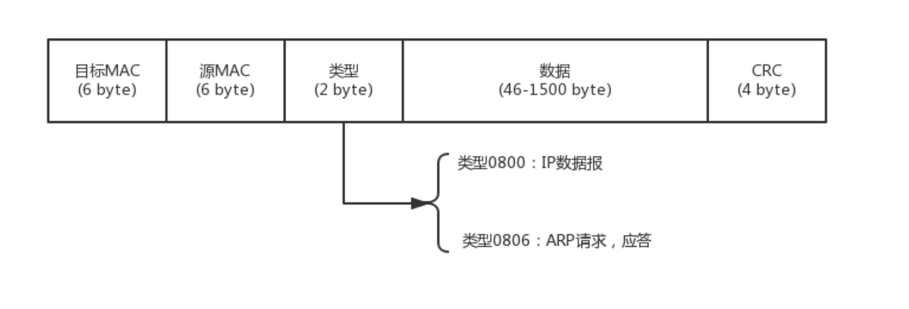

协议：

1. 语法
2. 语义
3. 顺序

只有通过网络协议，才能使机器相互协作，共同完成一件事

浏览器通过DNS或HTTPDNS协议拿到URL对应的IP地址，通过HTTP或HTTPS协议传输数据，这一层统称为应用层

经过应用层封装后，浏览器通过socket编程将包交给传输层处理

传输层有两种协议，一种是无连接的协议**UDP**，一种是面向连接的协议**TCP**。所谓的面向连接就是，TCP会保证这个包能够到达目的地，如果不能到达，就会重新发送直至到达。TCP 协议里面有两个端口，一个是浏览器监听的端口，一个是服务器监听的端口

传输层封装完毕后，浏览器会将包交给操作系统的网络层。

网络层的协议是IP协议，包含源IP地址和目标IP地址，操作系统要根据目标IP找到目标机器，需要判断IP是否在同一子网，如果不是则需要走网关，操作系统启动时DHCP协议会自动分配IP及配置默认网关192.168.1.1

链路层包括本机MAC地址和网关MAC地址，可以通过ARP协议获取网关的MAC地址

最后操作系统通过网卡将包发送至网关

网关收到包后，获取IP头，根据路由表获取到某个IP怎么走，常见的路由协议有OSPF和BGP

走到最后一个网关后，网关根据IP获取MAC地址，根据MAC地址就能找到目标服务器

目标服务器收到包后，先判断MAC地址，匹配之后取下MAC头，交给网络层判断IP地址，匹配之后取下IP头，交给传输层，TCP协议对于收到的每个包，都会回复一个表达收到的包，经过三次握手，TCP连接成功，根据TCP头中的目标端口，找到监听该端口的进程

操作系统进程间通信往往通过RPC调用，即远程过程调用，RPC框架有很多种，有基于 HTTP 协议放在HTTP的报文里面的，也有直接封装在TCP报文里面的

在网络上跑的包，都是完整的，可以有下层没上层，不能有上层没下层

### IP

ifconfig、ip addr

lo 全称是**loopback**，又称**环回接口**，往往会被分配到 127.0.0.1，这个地址用于本机通信，经过内核处理后直接返回，不会在网络中出现

CIDR：无类型域间选路

将 32 位的IP地址一分为二，前面是网络号，后面是主机号，ip后面的/24表示网络号为前24位

广播地址：将IP的主机号全改为1的地址

子网掩码：网络号全为1，主机号全为0的地址

CIDR可用于判断两个IP是否在同一子网，即网络号是否相同

ip和网关必须是一个网段的

DHCP：动态主机配置协议 Dynimic Host Configuration Protocol

新电脑接入网络，使用0.0.0.0发送一个广播包，目的IP为255.255.255.255，应用层协议为BOOTP，DHCP是BOOTP的增强版，传输层协议为UDP，这一步称为DHCP Discover

如果网络中配置了DHCP Server，它收到请求后会租出一个IP，包含子网掩码、网关等，这一步称为DHCP Offer

电脑收到后，选择一个Offer，并发送DHCP Request广播包，包含MAC地址、IP地址、分配的DHCP Server的地址等，使其它DHCP Server放弃为它分配的IP，DHCP Server收到后会发送DHCP ACK包，表示已接受

PXE：预启动执行环境，Pre-boot Execution Environment

PXE协议分为客户端和服务端，计算机启动时，BIOS把PXE客户端读入内存，由DHCP分配IP，并告诉客户端操作系统服务器的地址和启动文件，客户端通过TFTP协议下载

### MAC地址

网卡的物理地址，唯一

在同一个子网内可以通过MAC地址通信，但对于不同子网，需要使用IP地址

MAC地址缺少定位功能，所以出现了IP地址，MAC地址的通信范围局限在一个子网内

可以将IP理解为地址，MAC地址理解为身份证

### 状态标识

net_device flags

UP：启动状态

BROADCAST：网卡有广播地址，网卡可以发送广播包

MULTICAST：网卡可以发送多播报

LOWER_UP：L1启动，即插着网线

MTU：最大传输单元，以字节为单位，默认1500，MAC层的概念

qdisc：queueing discipline，排队规则，有pfifo，先进先出，也有pfifo_fast，包含三个波段Band，每个波段先进先出，三个波段中band0的优先级最高，数据包按照服务类型TypeOfService分配到三个波段，TOS放在IP头中

### 物理层

网线1、3和2、6脚分别负责收发信号

用网线电脑连电脑，使用**1-3，2-6交叉接法**，将一端的1号线和3号线、2号线和6号线互换位置，就可以实现一端发送的信息另一端能够接收到

有多台电脑时，使用Hub，即集线器，它工作在物理层，会将端口收到的每一个字节都复制到其它端口

LAN：局域网

### 数据链路层

谁先发谁后发？

包发给谁？谁接收？

发送过程中出错怎么办？

MAC：Media Access Control，控制谁先发谁后发，学名叫多路访问

* 信道划分
* 轮流协议
* 随机接入协议，以太网默认协议

需要用到一个物理地址来解决发给谁谁接收的问题，即链路层地址，因为链路层主要用于媒体接入控制，也被叫做MAC地址

以太网链路层包格式：

最后为CRC，循环冗余检测，通过异或算法，计算包在传输过程中是否出错

ARP协议：已知IP地址获取MAC地址

RARP协议：已知MAC地址获取IP地址

交换机：Hub采用广播的方式，设备多了之后会产生冲突，交换机是回学习的集线器，记录MAC地址应该走哪个口，交换机是一个二层设备，交换机的学习结果称为转发表

环路问题：STP协议，防止二层网络的广播风暴

为什么路由表获取IP后还要获取MAC地址

路由协议中下一站的IP放在哪

二层设备、三层设备、四层 LB 和七层 LB 中层

所谓的二层设备、三层设备，都是这些设备上跑的程序不同而已。一个 HTTP 协议的包经过一个二层设备，二层设备收进去的是整个网络包。这里面 HTTP、TCP、 IP、 MAC 都有。什么叫二层设备呀，就是只把 MAC 头摘下来，看看到底是丢弃、转发，还是自己留着。那什么叫三层设备呢？就是把 MAC 头摘下来之后，再把 IP 头摘下来，看看到底是丢弃、转发，还是自己留着。

从你的电脑，通过 SSH 登录到公有云主机里面，都需要经历哪些过程？或者说你打开一个电商网站，都需要经历哪些过程？

net-tools 和 iproute2 的故事？

16.158.165.91/22 的 第一个地址、子网掩码、广播地址

PXE协议如何只在第一次安装，其他时候正常启动
