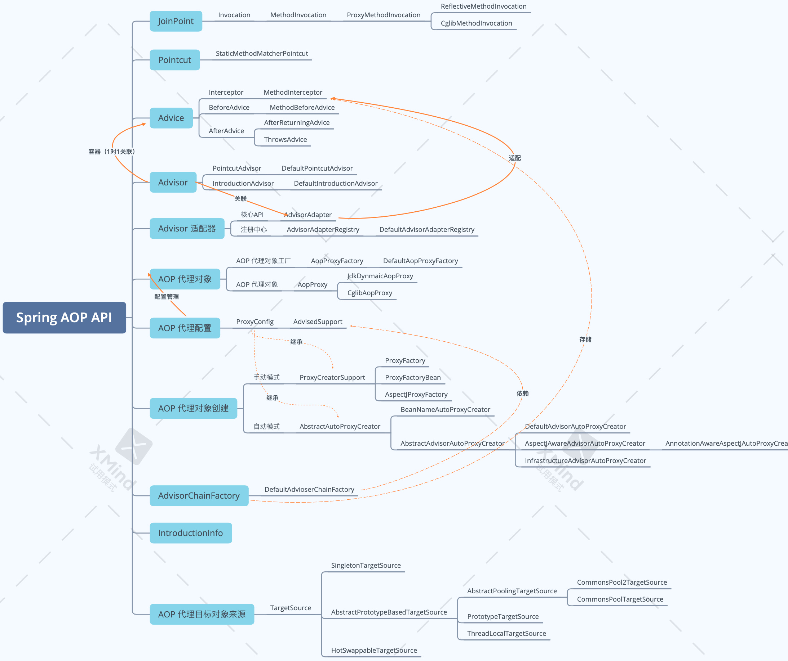

### OOP的局限性

静态化语言：类结构一旦定义，不容易修改

侵入性扩展：通过继承和组合组织新的类结构

### AOP使用场景

日志

* 诊断上下文：如log4j和logback的MDC

* 辅助信息：统计时间

统计

* 方法调用次数
* 执行异常次数
* 数据抽样
* 数值累加

监控

* 熔断，如Netflix Hystrix
* 限流和降级，如Alibaba Sentinel
* 认证和鉴权，如Spring Security
* 监控，如JMX

性能

* Spring Cache
* 超时控制

### 常用概念

1. Aspect(切面) 
    切入点和通知(引介)的集合
2. Join Point(连接点) 
    程序执行中的一个点，即方法或字段，但在Spring中，这些点指方法
3. Pointcut(切入点) 
    匹配Join Point的条件
4. Advice(通知/增强) 
    在Join Point处所要采取的行为
    Advice分为before、after、after-throw、after-return、around
5. Introduction(引介) 
    特殊的通知，可以在运行期动态为类增加方法或字段，可以为增强类新增实现接口
6. Weaving(织入) 
    把通知应用到目标对象来创建新的代理对象的过程 
    Spring采用动态代理织入，而AspectJ采用编译期织入和类装载期织入  

### 代理模式

静态代理

* 组合和继承

动态代理

* JDK Proxy，基于接口
* CGLIB，基于类代理

### 判断模式

来源

* 类
* 方法
* 注解
* 参数
* 异常

### 拦截模式

* 前置拦截
* 后置拦截
* 异常拦截

### Spring AOP

特性

* 纯Java实现，无编译时特殊处理，不修改和控制ClassLoader
* 仅支持方法级别的Join point
* 非完整AOP实现
* Spring IOC整合
* AspectJ整合

设计目标

有别于传统AOP框架，并非提供完整AOP实现，而是提供AOP和IoC的紧密集成

和AspectJ相辅相成，提供完整的解决方案

Introduction：IntroductionInfo

代理对象创建基础类：ProxyCreatorSupport

代理工厂：ProxyFactory、ProxyFactoryBean、AspectJProxyFactory

AopProxyFactory配置管理器：AdvisedSupport

IoC容器自动代理抽象：AbstractAutoProxyCreator

### Joinpoint

Invocation：Interceptor执行上下文

* MethodInvocation
    * ReflectiveMethodInvacation
    * CglibMethodInvocation

### Pointcut

Pointcut

* ClassFilter

* MethodMatcher

ComposablePointcut：组合条件

* ClassFilters
* MethodMatchers
* Pointcuts

常用实现

* StaticMethodMatcherPointcut
* JdkRegexMethodPointcut
* ControlFlowPointcut
* AspectJExpressionPointcut
    * SUPPORTED_PRIMITIVES：支持的指令集合
    * PointcutExpression

### Advice

* Around Advice：Interceptor
    * MethodInterceptor
    * ConstructorInterceptor
* 前置Advice：BeforeAdvice
    * MethodBeforeAdvice

* 后置Advice
    * AfterAdvice
    * AfterReturningAdvice
    * ThrowsAdvice

* AspectJ
    * AspectJAroundAdvice
    * AspectJMethodBeforeAdvice
    * AspectJAfterAdvice
    * AspectJAfterReturningAdvice
    * AspectJAfterThrowingAdvice
* 适配器实现
    * MethodBeforeAdviceInterceptor
    * AfterReturningAdviceInterceptor
    * ThrowsAdviceInterceptor

### Advisor

包含一个Advice

* Advisor

    * PointcutAdvisor
        * DefaultPointcutAdvisor
        * StaticMethodMatcherPointcutAdvisor
        * AspectJExpressionPointcutAdvisor
        * AspectJPointcutAdvisor
        * AbstractBeanFactoryPointcutAdvisor

    * IntroductionAdvisor
        * DefaultIntroductionAdvisor
        * DeclareParentsAdvisor

* AdvisorAdapter
    * MethodBeforeAdviceAdapter
    * AfterReturningAdviceAdapter
    * ThrowsAdviceAdapter

### AopProxy

* AopProxy
    * JdkDynamicAopProxy
    * CglibAopProxy
        * ObjenesisCglibAopProxy
* AopProxyFactory：创建AopProxy的工厂
    * DefaultAopProxyFactory
* AdvisedSupport：AopProxyFactory的配置

### ProxyCreatorSupport

* ProxyFactory：标准代理工厂
* AspectJProxyFactory
* ProxyFactoryBean

### 自动代理

AbstractAutoProxyCreator：SmartInstantiationAwareBeanPostProcessor

* DefaultAdvisorAutoProxyCreator
* BeanNameAutoProxyCreator
* InfrastructureAdvisorAutoProxyCreator
* AspectJAdvisorAutoProxyCreator

@Pointcut

* execution，匹配连接点，两个点表示任意目录或子目录或任意参数，*表示匹配任意字符
    * execution(modifiers-pattern? ret-type-pattern declaring-type-pattern?name-pattern(param-pattern) throw-pattern?
* this，限制连接点匹配AOP代理的bean引用为指定类型
* within，@within，限制连接点匹配指定的类型或匹配指定注解所标注的类型
* target，@target，限制连接点匹配目标对象为指定类型的类或目标对象类具有指定类型的注解
* args，@args，限制连接点匹配参数为指定类型或指定注解的执行方法
* @annotation，限定匹配带有指定注解的连接点
    * Spring额外增加bean，限定bean

Advice

* 注解
    * @Around，同一个切面中，@Around在@Before之前
    * @Before，同一个切面中，@Before的顺序无法控制
    * @After
    * @AfterReturning
    * @AfterThrowing
* XML，XML配置的Advice按照声明顺序执行
    * \<aop:around/>
    * \<aop:before/>
    * \<aop:after/>
    * \<aop:after-returning/>
    * \<aop:after-throwing/>
