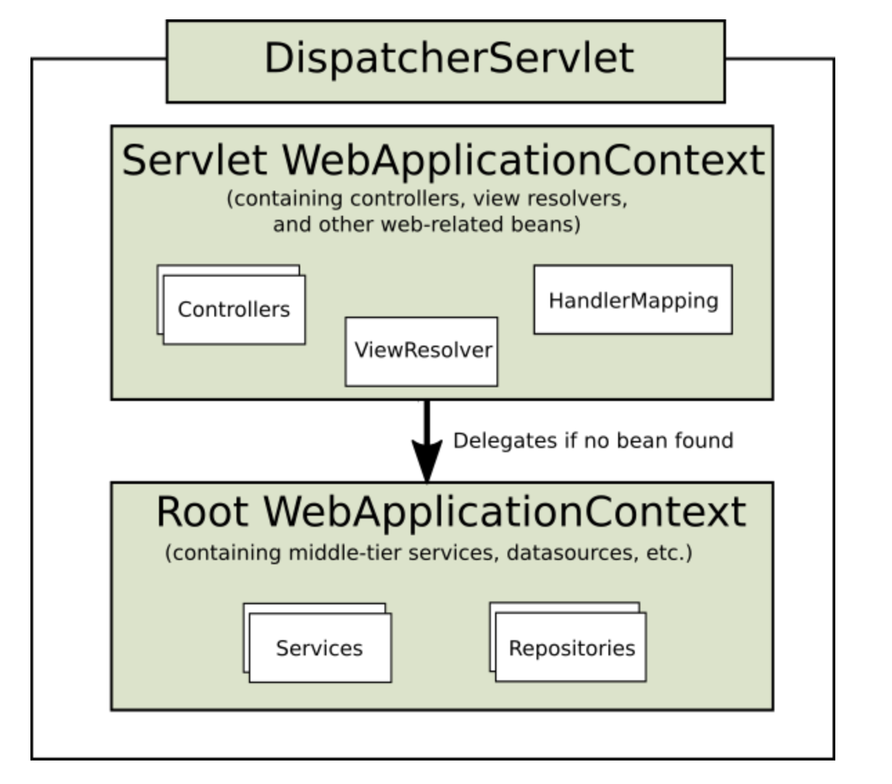
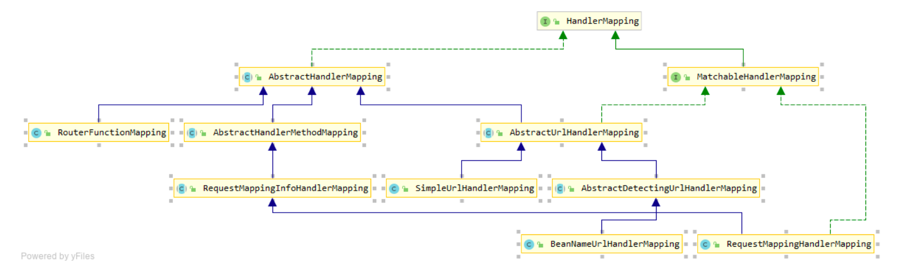
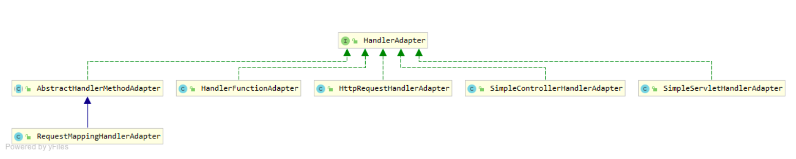

### DispatcherServlet

基于Front Controller模式设计，DispatcherServlet提供了用于请求处理的共享算法，而请求映射、视图解析、异常处理等实际工作由可配置的委托组件执行

* web.xml
    * ContextLoadListener配置Root WebApplicationContext
    * XmlApplicationContext没有配置configLocation时，getDefaultConfigLocations
        1. DispatcherServlet：默认配置文件为/WEB-INF/ServletName-servlet.xml
        2. ContextLoadListener：默认配置文件为/WEB-INF/applicationContext.xml
* WebApplicationInitializer
    * ServletContainerInitializer SPI 加载SpringServletContainerInitializer处理WebApplicationInitializer
    * AbstractAnnotationConfigDispatcherServletInitializer

依赖：默认使用DispatcherServlet.properties中声明的依赖

#### HandlerMapping

根据请求找到Handler及Interceptor，封装为HandlerExecutionChain返回给DispatcherServlet

路径匹配

* 基于去除contextPath和servletMapping前缀的路径寻找Handler

拦截

* HandlerInterceptor
* preHandle顺序调用，返回false时，不会执行接下来的拦截器和Handler
* postHandle逆序调用，所有拦截器返回true时才调用
* afterCompletion逆序调用，只有preHandle返回true时才调用
* 对于@ResponseBody和ResponseEntity，postHandle失效，response已经被写入HandlerAdapter，可以实现ResponseBodyAdvoce并标注@ControllerAdvice解决，也可直接将其注册入RequestMappingHandlerAdapter

#### HandlerAdapter

根据适配器接口对Handler包装后执行

#### HandlerExceptionResolver

Exception处理策略，如映射到Handler或HTML错误页面

在requestMapping阶段或Handler执行抛出异常，异常被放入ExceptionHandlerResolver Chain，返回

* ModelAndView指向错误页面
* 空ModelAndView，表明Exception已被Resolver解决
* null，表明无法处理，交给下一个ExceptionHandlerResolver

#### ViewResolver

ViewResolver：提供view name和view之间的映射

View：解决数据传递给特定视图技术之前的准备工作

JSP场景只能通过RequestDispatcher确认是否存在，需要配置InternalResourceViewResolver，且优先级最低

#### MultipartResolver

文件上传

* CommonMultipartResolver，适用于Servlet3.0之前的前版本，依赖common-fileupload
* StandardServletMultipartResolver，适用于Servlet3.0之后的版本，无依赖，但需配置
    * XML：multipart-config
    * Java：registration.setMultipartConfig

#### LocaleResolver

* AcceptHeaderLocaleResolver，默认配置，通过Header的accept-language指定
* LocaleContextResolver
    * CookieLocaleResolver
    * SessionLocaleResolver
    * FixedLocaleResolver

RequestContext.getLocale

#### 

#### ThemeResolver

#### FlashMapManager

#### 请求处理流程

doService

* 关联的WebApplicationContext通过DispatcherServlet.WEB_APPLICATION_CONTEXT_ATTRIBUTE放入Request Attribute
* 关联的LocaleResolver通过DispatcherServlet.LOCALE_RESOLVER_ATTRIBUTE放入Request Attribute
* 关联的ThemeResolver通过DispatcherServlet.THEME_RESOLVER_ATTRIBUTE放入Request Attribute
* 如果配置了MultipartResolver，并且请求中有Multipart，请求被处理为MultipartHttpServletRequest
* 找到一个合适的Handler处理请求
* 视图渲染

#### Handler

返回值

* ModelAndView
* Void
* String，视图名或字符串(@ResponseBody，注意编码)
* 实体类，@ResponseBody + JSON解析器，默认支持Jackson

参数

* Model / ModelMap
* HttpServletRequest
* HttpServletResponse
* HttpServletSession
* 基本数据类型及其包装类，String
* 实体类
* 自定义参数转换，Converter，针对未提供类型转换的类型
* 数组、集合、Map

### Filter

* FormContentFilter
* Forwarded

